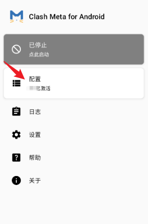
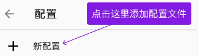
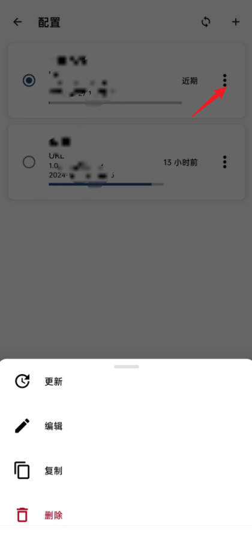

> Clash Meta for Android

## 简介

Clash 是一个使用 Go 语言编写，基于规则的跨平台代理软件核心程序。

> Clash Meta for Android 是安卓系统上的一款 Clash 客户端。
> 支持的协议：`Vmess`, `Shadowsocks`, `Snell` , `SOCKS5`

## 系统要求（Requirement）

- Android 5.0+ (minimum)
- Android 7.0+ (recommend)
- armeabi-v7a , arm64-v8a, x86 or x86_64 Architecture

## 下载安装

> Clash Meta for Android 为免费 app ，也可在 `F-Droid` 市场下载

- 国内下载地址:
    - 
- F-Droid下载地址：
    - 
- GitHub Releases
    - 

## 快速上手 

Clash Meta for Android 支持两种导入配置文档的方式：

- URL （订阅）
- 本地导入

### 快速订阅

- 请先登陆代理供应商官网，复制 Clash 订阅地址。

- 复制好了 Clash 订阅码之后打开 `Clash Meta for Android` 应用程序。请点击 `配置`。
    - 

- 请在新弹出的窗口中点击 `新配置`。
    - 
- 然后选择从 `URL` 导入。在对应地方填写订阅地址并保存。

- 点击节点右侧的三个点按钮，可以修改订阅设置。如图
    - 

> 提示：机场服务器信息可能会不定时更新，若出现大面积节点超时现象，可尝试刷新订阅。
> 返回首页。点击开关，即可进行代理。会提示是否同意创建 VPN，请点击 `允许`。

- 开启代理后，可以点击中间的代理选项卡，进入策略组面板，在这里可以切换节点。直接点击你想要的节点即可进行切换。

- 点击`⚡`图标可以进行延迟测试，测试结果将显示在节点名称右侧。

> Clash Meta for Android 测试延迟的方法为从目标 policy 返回 http response header 数据包的时间，并不是简单的 ping 。
> 测试延迟会导致机场网页上显示的在线设备数异常飙升，这是正常现象，等一等就好了
